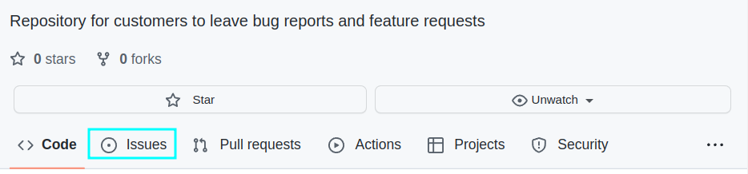
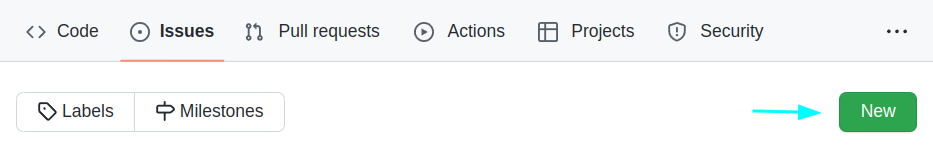
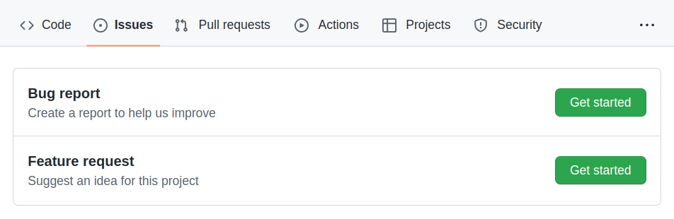
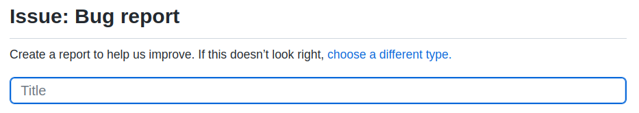
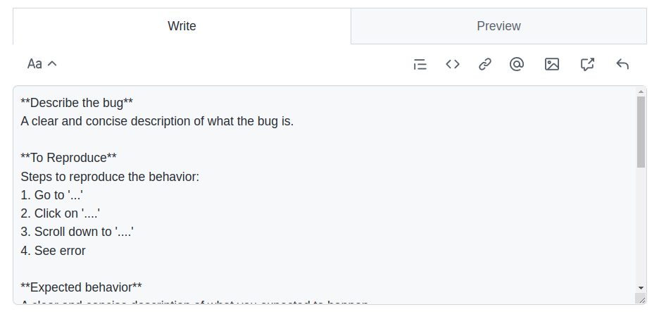

# Customer Feedback

Repository for customers to leave bug reports and feature requests.

## Steps

1. Go to issues

2. Click the create new issue button

3. Select the appropriate template

4. Enter a descriptive title

5. Fill out the template as best as you can

6. We will get back to you as quick as we can!

Thank you for being a customer 🙂
